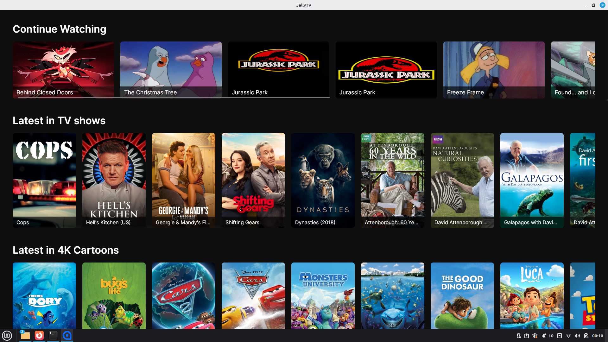
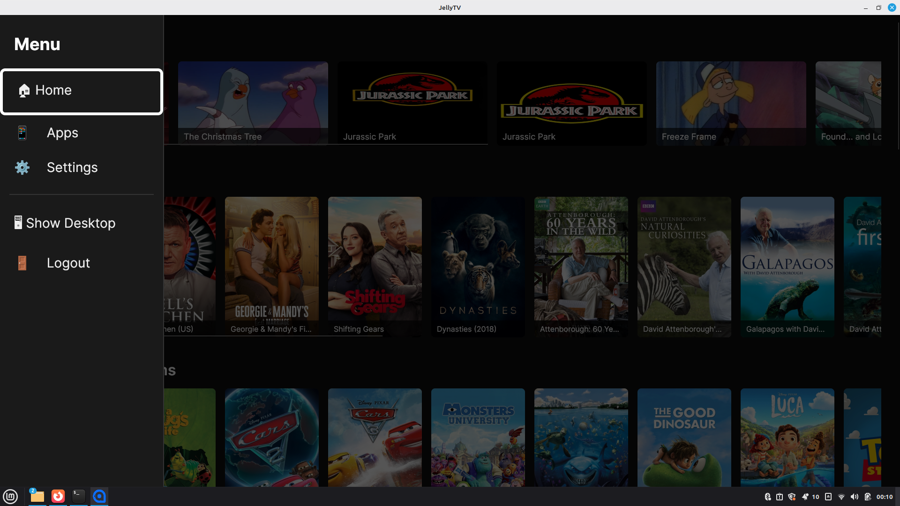
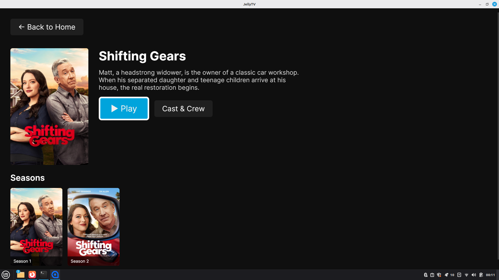
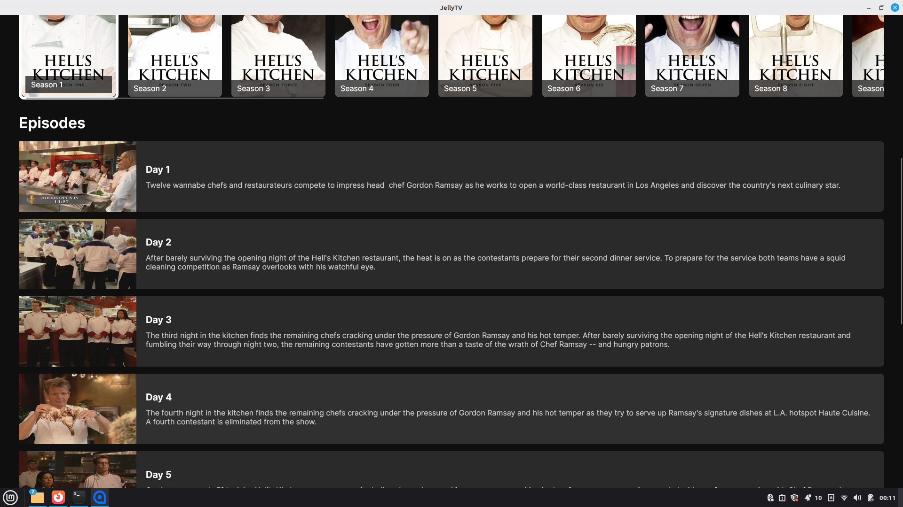

# JellyTV

A sleek, gamepad-friendly TV interface for Jellyfin/Emby media servers built with AvaloniaUI.



## Features

- **TV-Optimized Interface** - Designed for big screens and couch viewing
- **Full Gamepad Support** - Navigate with your favorite controller (PlayStation, Xbox, etc.)
- **Custom Media Player** - FFmpeg-based player with hardware acceleration
- **Continue Watching** - Pick up right where you left off
- **Browse Libraries** - TV Shows, Movies, and 4K Cartoons with beautiful poster artwork
- **Series Management** - Browse seasons and episodes with detailed information
- **Sidebar Navigation** - Quick access to apps, settings, and menu (toggle with R1)
- **On-Screen Keyboard** - Text input without leaving your controller

## Screenshots

### Home Screen

*Continue watching your favorite shows and browse your media library*

### Sidebar Menu

*Quick access to apps, settings, and navigation (toggle with R1)*

### Show Details

*View show information and select seasons*

### Season Browser

*Browse available seasons with poster artwork*

### Episode List

*Detailed episode information with thumbnails and descriptions*

### Video Playback

*Custom video player with integrated controls*

## Gamepad Controls

- **D-Pad/Left Stick** - Navigate menus and controls
- **A Button** - Select/Play/Pause
- **B Button** - Back/Stop playback
- **R1** - Toggle sidebar menu
- **Arrow Keys** - Show player controls during playback

## Tech Stack

- **AvaloniaUI** - Cross-platform XAML-based UI framework
- **AvaloniaMediaPlayer** - Custom FFmpeg-based media player
- **CommunityToolkit.MVVM** - Modern MVVM patterns
- **FFmpeg** - Video/audio decoding with hardware acceleration
- **.NET 8** - Modern, high-performance runtime

## Requirements

- .NET 8 Runtime
- Jellyfin or Emby server
- Linux (tested on Debian)
- Gamepad (optional but recommended)

## Installation

```bash
# Clone the repository
git clone https://github.com/crucifix86/JellyTV.git
cd JellyTV/JellyTV

# Build and run
dotnet restore
dotnet build
dotnet run
```

## Configuration

On first launch, you'll be prompted to:
1. Enter your Jellyfin/Emby server address
2. Login with your credentials
3. Select your preferred libraries

Settings are saved in `~/.config/JellyTV/config.json`

## Development

Built with love for the couch potato in all of us. Contributions welcome!

### Project Structure

```
JellyTV/
├── Controls/           # Custom UI controls (VideoPlayerControl, OnScreenKeyboard)
├── ViewModels/        # MVVM ViewModels
├── Views/             # XAML views
├── Services/          # Business logic (JellyfinClient, GamepadInputService)
├── Converters/        # Value converters for bindings
└── Models/            # Data models
```

## License

MIT License - Feel free to use and modify as you wish!

## Acknowledgments

- Jellyfin team for the amazing media server
- Avalonia team for the cross-platform UI framework
- FFmpeg for the media decoding magic
